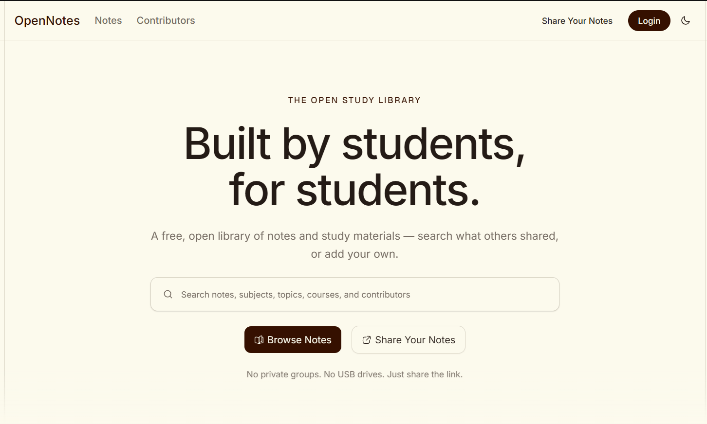

# OpenNotes

> A public, community-driven platform for discovering, sharing, and accessing educational notes.

OpenNotes is an educational notes platform where students, teachers, and contributors can share useful study materials with learners everywhere.



The platform is designed to solve a simple problem: useful educational notes are often trapped inside private messaging groups, local devices, or individual classrooms. OpenNotes provides a public, searchable place where students can discover, view, download, and share educational resources.

[Website Link](https://opennotesbyme.vercel.app)

---

## ✨ Features

### 📚 Discover Notes

- Browse publicly available notes
- Search by title, subject, topic, contributor, and other metadata
- Filter notes by education level, grade, category, and more
- Sort by newest, most viewed, most downloaded, and relevance
- View detailed note information
- Discover related notes

### 📄 PDF Notes

- Upload PDF educational materials
- Browser-based PDF viewing
- Download public notes
- File size and type validation
- SHA-256 file hashing for duplicate detection
- PDF metadata such as page count and file size

### 👥 Contributors

- Public contributor profiles
- Contributor usernames
- Contributor biographies
- Published contributions
- Contribution statistics
- Contribution activity graph
- Contributor rankings
- Contributor badges and recognition

Contributors must also provide information about the source of material they upload.

This helps OpenNotes distinguish between content created by the contributor and material shared under another legitimate basis.

---

# ⚙️ Installation

Clone the repository:

```bash
git clone <repository-url>
cd opennotes
```

Install dependencies:

```bash
npm install
```

Or:

```bash
pnpm install
```

---

## License

The OpenNotes application source code is licensed under the MIT License.

Copyright © 2026 OpenNotes Contributors

See the [LICENSE](./LICENSE) file for the complete license text.

---

# 🤝 Contributing to OpenNotes

Contributions to the OpenNotes codebase are welcome.

Before submitting a pull request:

1. Create a branch.
2. Make your changes.
3. Run linting and type checks.
4. Test the affected functionality.
5. Keep the changes focused.
6. Explain important architectural decisions in the pull request.

For larger changes, open an issue or discussion first.

---

# 💡 Philosophy

OpenNotes is built around a simple idea:

> Useful knowledge should be easy to discover and easy to share.

A student should be able to find the material they need.

A teacher should be able to share a resource with an entire classroom.

A contributor should be recognized for helping others.

And the platform should make all three experiences simple.

---

## OpenNotes

**Find notes. Share knowledge. Learn together.**
